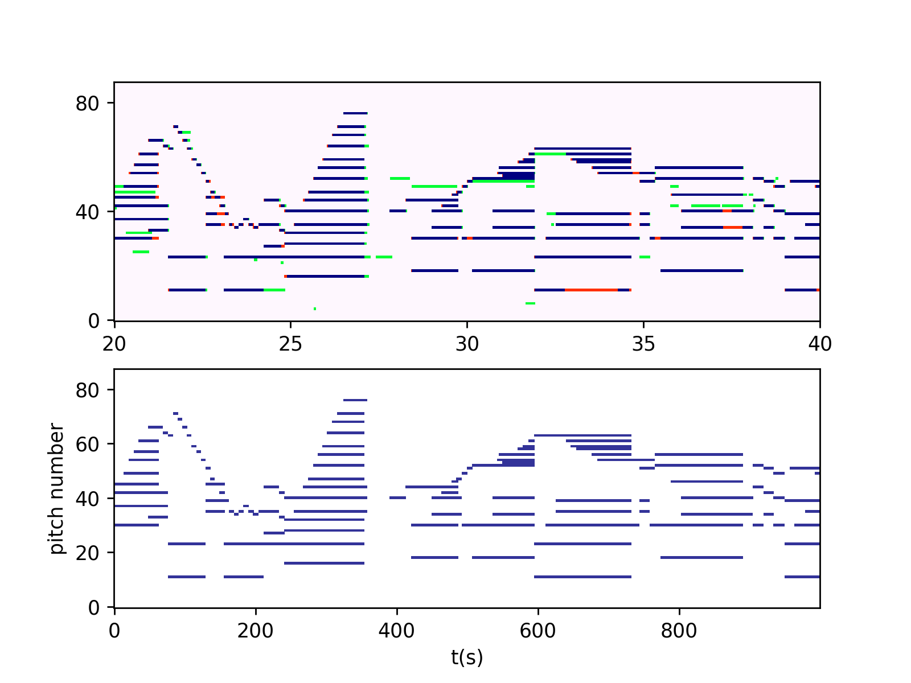
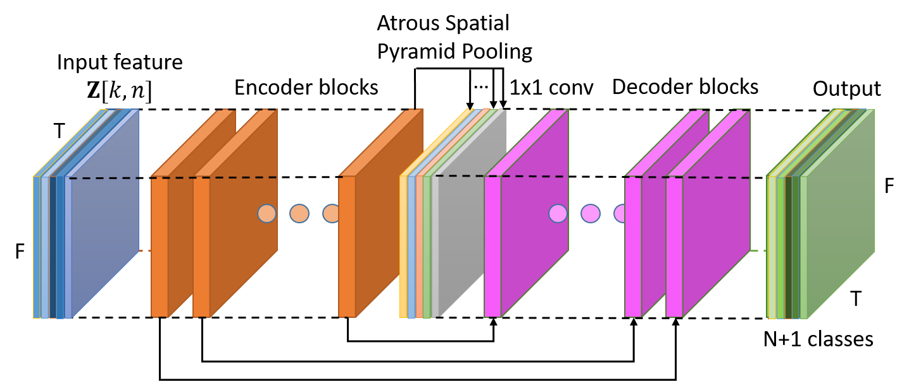

# Music Transcription with Semantic Model


## Table of Content

* [About](#About)
* [Overview][#Overview]
* [Usage](#Usage)
  * [Pre-processing](#pre-processing)
  * [Training](#training)
  * [Prediction](#prediction)
  * [Evaluation](#evaluation)
  * [Single Song Transcription](#single-song-transcription)
  * [Extra](#extra)
    * [Print Piano Roll](#print-piano-roll)


## About

This is a AMT (Automatic  Music Transcription) project, combined with state-of-the-art image semantic segmentation neural network model. 

The dataset used is MAPS and MusicNet, which the first one is a solo-piano performance collection, and the second is a multi-instrument performance collection.  On both dataset, we achieved the state-of-the-art results on MPE (Multi-Pitch Estimation) case frame-wisely, which on **MAPS** we achieved **F-score 86.73%**, and on **MusicNet** we achieved **F-score 73.70%**.

This work was done based on our prior work of [repo1](https://github.com/BreezeWhite/CFP_NeuralNetwork), [repo2](https://github.com/s603122001/Vocal-Melody-Extraction). For more about our works, please meet our [website](https://sites.google.com/view/mctl/home).

The original paper is under reviewing. Coming soon....

## Overview

One of the main topic in AMT is to transcribe a given raw audio file into symbolic form, that is transformation from wav to midi.  And our work is the middle stage of this final goal, which we first transcribe the audio into what we called "frame level" domain. This means we split time into frames, and the length of each frame is 88, corresponding to the piano rolls. And then make prediction of which key is in activation. 

Here is an example output:



The top row is the predicted piano roll, and the bottom row is the original label. Colors blue, green, and red represent true-positive, false-positive, and false-negative respectively.

We used semantic segmentation model for transcription, which is also widely used in the field of image processing.  This model is originally improved from DeepLabV3+, and further combined with U-net architecture and focal loss, Illustrated as below: 




## Usage

#### Pre-processing

1. Download dataset from the official website of MAPS and MusicNet.

2. run the command to pre-process the audios

   for MusicNet, `cd MusicNet/`  and execute this command:

   ```
   python3 FeatureExtraction.py --MusicNet-path <path/to/downloaded/folder>
   ```

   for MAPS, `cd MAPS/` and execute this command:

   ```
   python3 FeatureExtraction.py --MAPS-path <path/to/downloaded/folder>
   ```

3. For more detail usage, run `python3 FeatureExtraction.py --help`

---

#### Training

There are some cases for training, by defining different input feature type and output cases. 

For input, you can either choose using **HCFP** or **CFP** representation, depending on your settings of pre-processed feature.  

For output, you can choose to train on **MPE mode** or **multi-instrument mode**, if you are using MusicNet for training. If you are using MAPS for training, then you can only train on MPE mode.


  To train the model on MusicNet, run the command:

  ```
  python3 TrainSemanticModel.py --MusicNet-feature-path <path/to/extracted/feature> \
                                -o <output/model/name>
  ```

  The default case will train on **multi-instrument mode** by using **HCFP** features. You can train on MPE mode by adding `--mpe-only` flag, or change to use CFP feature by adding `--no-harmonic` flag.


  There are also some cases you can specify to accelerate the progress. Specify `--use-ram` to load the whole features into the ram if your ram is big enough (at least 64 GB).

  To validate the execution of the training command, you can also specify less epochs and steps by adding `-e 1 -n 500`. 

  And to continue train on a pre-trained model, add `--input-model <path/to/pre-trained/model>`.

  There are also some callbacks being applied to the training. You can find it around *line 130~140* in *TrainSemanticModel.py*.

---

#### Prediction

After training has been done, you can generate the predictions now.

```
python3 Predict.py --model-path <path/to/model> \
                   --test-path <test/feature/path>
```

The flag `--test-path` can both be a directory or a *.hdf* feature file. If is a directory, then all the files inside this dir will be processed. 

If you want to evaluate on the predictions after finished this command, add                                                `--label-path <path/to/test/label>` to generate and preserve the corresponding label files.

The predictions will automatically be saved as a *.hdf* file. You can specify the save path by adding           `--pred-save-path <path/to/save>`.

If your ram is not big enough, add `--use-ram False`.

There are also some pre-trained model appended in *CheckPoint* folder. You can see the configuration file for the detail information about what dataset is this model trained on, what type of feature does this model use, and what will it output.

---

#### Evaluation

To evaluate the scores of the predictions with label, run the command:

```
python3 Evaluation.py --test-pred-path <path/to/predictions>
```

Because the final results are depending the setting of threshold, you would need a validation set to fairly set the threshold. Add `--val-pred-path <path/to/val/predictions>`, and don't forget to generate the predictions first. If this flag is not given, the threshold will be set depending the test set.

The default instrument to evaluate is 0, which is the first channel. There are 11 channels in the prediction of MusicNet. For the code and their indication of instruments are listed below:

| Channel Num | Instrument  |
| :---------: | :---------: |
|      0      |    Piano    |
|      1      | Harpsichord |
|      2      |   Violin    |
|      3      |    Viola    |
|      4      |    Cello    |
|      5      | Contrabass  |
|      6      |    Horn     |
|      7      |    Oboe     |
|      8      |   Bassoon   |
|      9      |  Clarinet   |
|     10      |    Flute    |

You can specify which instrument to evaluate by add `--spec-instrument <channel_num>`.

---

#### Single Song Transcription

To transcribe on a single song, run the command:

```
python3 SingleSongTest.py -i <input/audio> -m <path/to/pre-trained/model>
```

This will output a figure of predicted piano roll without thresholding. And the figure will be under the same path as the given audio. 

---

#### Extra

###### Print Piano Roll

To print out the predictions as images, like above shown, run the command:

```
python3 PrintPianoRoll.py -p <path/to/prediction>
```

The path to the folder should containing *pred.hdf* and *label.hdf*. For each figure, there will at most 4 rows, and two as a group, presenting prediction row and label row to the same piece. If there is no *label.hdf* file, the label row would be the same as prediction row.

The default setting will print original output values, without thresholding.  If you want to print a thresholded figure, add `--quantize` flag. 

To specify output path and figure name, add `-o <path/to/output> -f <figure_name>`.

Notice that if turn on both `--quantize` and `--spec-instrument` to print out some specific instrument channels, you will also need to specify the flag:`--threshold <[list of thresholds]>`, with the same length of specified instruments.

## Todo

- [x] Add single-song-test function
- [x] Add function to print out piano rolls
- [ ] Add configuration of thresholds to the model
